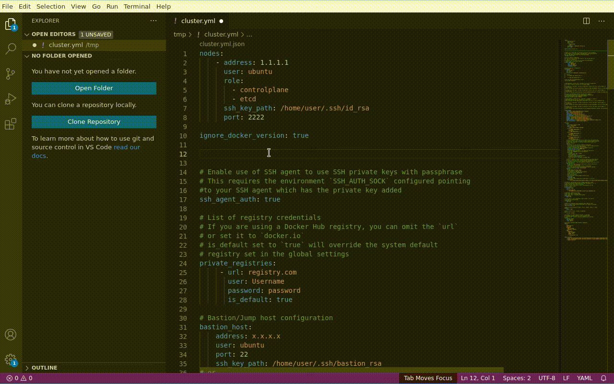
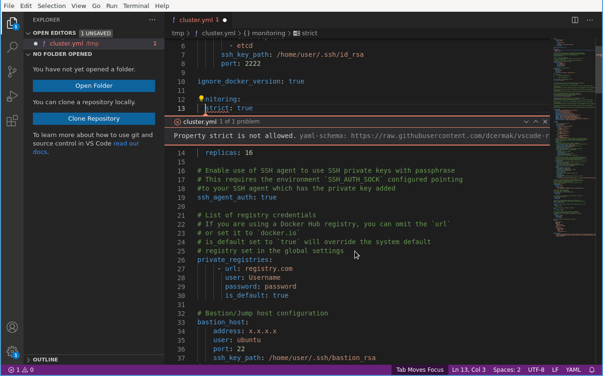
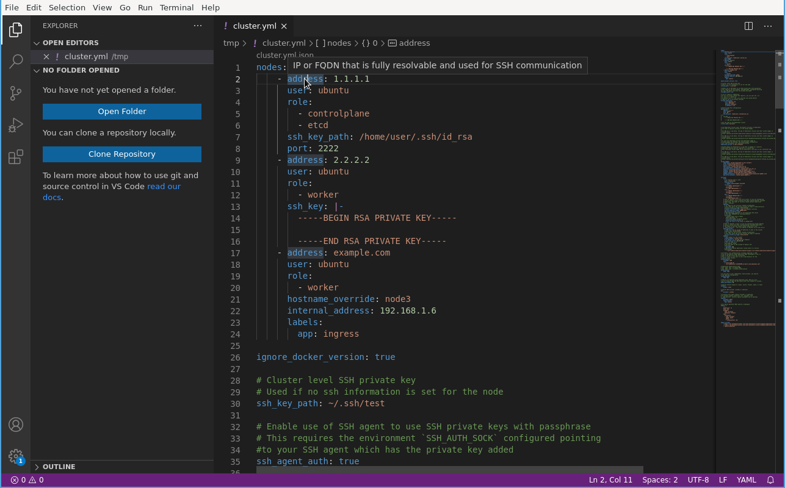
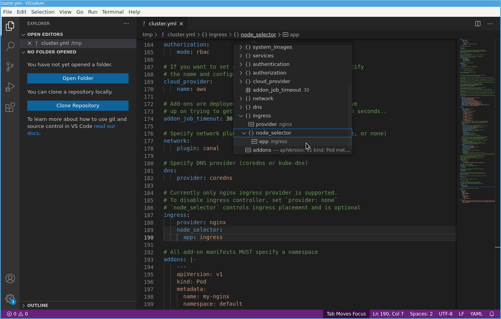

# VSCode extension for RKE Cluster Configuration files

# VSCode extension for RKE cluster configuration

Ever needed to make quick edit in RKE's `cluster.yaml` configuration file, but
didn't rember the exact name of a key? Or what that other parameter five lines
below meant? And preferably check beforehands whether the configuration file is
valid instead of testing it in production?

Now you can get all of that from within Visual Studio Code using this extension!

## Features

The extension builds upon the
[YAML](https://marketplace.visualstudio.com/items?itemName=redhat.vscode-yaml)
plugin for VSCode and adds the following capabilities:

- Autocompletion of Configuration keys and values:

- The configuration file is automatically checked against the schema and errors
  are highlighted:

- Hovering over a a key in the configuration file will show the documentation of
  that option (if available):

- You can use
  [Breadcrumbs](https://code.visualstudio.com/Docs/editor/editingevolved#_breadcrumbs)
  to quickly jump through the configuration file (these are provided by the
  [YAML](https://marketplace.visualstudio.com/items?itemName=redhat.vscode-yaml)
  extension):

And the best part? If you are already using the
[YAML](https://marketplace.visualstudio.com/items?itemName=redhat.vscode-yaml)
plugin, then you don't have to anything to get these features! VSCode will
provide you with all of the above as long as your configuration file is called
`cluster.yml` or `cluster.yaml`.

## Development

Requirements:

- go
- nodejs and yarn

The schema is generated using the
[alecthomas/jsonschema](https://github.com/alecthomas/jsonschema) module from
the structs in
[rancher/rke/blob/master/types/rke_types.go](https://github.com/rancher/rke/blob/master/types/rke_types.go).
This is performed by `dump_cluster_config_schema.go` with some additional post
processing steps performed in `process-schema` (the `$schema` key is removed,
because the validator fails to handle it and the extracted documentation is
added as the description field) via `yarn run schema`.
